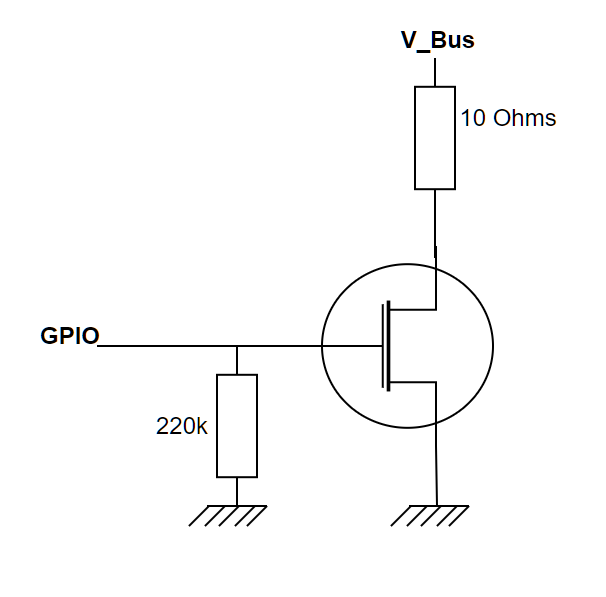
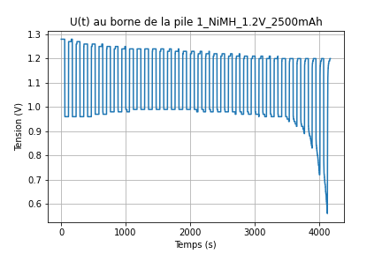
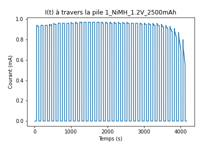
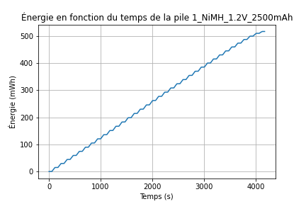
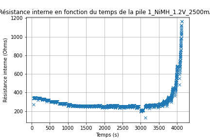
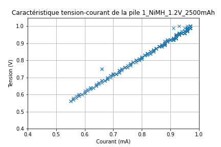

# Gestion de Décharge de Pile avec INA3221

## Introduction

Dans ce projet, j'ai développé un système de gestion de décharge de pile utilisant le module INA3221, qui permet de mesurer la tension de bus et la tension de shunt (représentant le courant de décharge) à travers une liaison I2C. L'objectif principal était de configurer le module INA3221, de lire ses valeurs périodiquement, de les enregistrer via une liaison série vers un PC, puis de les analyser pour obtenir des informations telles que la résistance interne de la pile, la tension en fonction du temps, le courant en fonction du temps, l'énergie totale fournie par la pile, ainsi que la caractéristique tension-courant de la pile.

## Utilisation du Module INA3221

J'ai créé deux fonctions principales pour interagir avec le module INA3221 :

1. **Configuration du Module**: Cette fonction permet de configurer les paramètres du module INA3221, tels que la plage de mesure, la précision et le taux de conversion. Ces paramètres sont cruciaux pour garantir des mesures précises et fiables.

2. **Lecture des Mesures**: Après la configuration, cette fonction lit périodiquement les valeurs de tension de bus et de tension de shunt à travers une liaison I2C. Ces valeurs sont ensuite utilisées pour calculer le courant de décharge de la pile.

## Gestion du Temps avec un Timer

Pour lire les mesures périodiquement, j'ai utilisé un timer pour déclencher une interruption toutes les 1 seconde. À chaque interruption, la fonction de lecture des mesures est appelée pour récupérer les données du module INA3221.

## Difficultés Rencontrées

Une difficulté majeure que j'ai rencontrée était la gestion du temps dans un environnement temps réel. Initialement, j'ai tenté d'implémenter la lecture des mesures dans une tâche, mais j'ai rapidement réalisé que le temps dérivait, ce qui aurait faussé mes mesures. Pour résoudre ce problème, j'ai opté pour l'utilisation d'un timer pour garantir une précision temporelle constante.

## Circuit de décharge

Le transistor utiliser est une MOSFET de réference BUK9832-55A, qui se caractérise par sa résistance entre drain source de faible valeur (36m$\Omega$ pour $V_{GS}=4.5V$) pour que son influence sur le courant de décharge soit négligeable. La décharge peut être réglable, dans l'exemple montrer ci-dessous: j'ai fait des courant de décharge en forme de créneau de periode 2min (1min de décharge). Aussi, afin de ne pas déteriorer la pile de 1.2V tension nominale, quand la tension de décharge atteint une seuil de tension de 0.6V, il faut arrêter la décharge.

## Traitement des Données

Une fois les mesures récupérées, je les envoie via une liaison série vers un PC. Sur le PC, un programme reçoit les données et les enregistre dans un fichier. J'ai ensuite utilisé des outils comme Excel pour analyser ces données. J'ai délimité les données de tension et de courant, puis j'ai calculé la résistance interne de la pile en fonction du temps.

## Analyse des Données

En utilisant les données enregistrées, j'ai pu tracer plusieurs graphiques pour mieux comprendre les performances de la pile :

1. **Tension en Fonction du Temps**: Ce graphique montre comment la tension de la pile évolue au fil du temps, ce qui peut donner des informations sur sa décharge.

2. **Courant en Fonction du Temps**: Ce graphique illustre le courant de décharge de la pile au fil du temps, ce qui permet de visualiser sa performance.

3. **Énergie Totale Fournie par la Pile**: En intégrant le produit de la tension et du courant sur la période de décharge, j'ai calculé l'énergie totale fournie par la pile.

4. **Résistance interne de la pile**: Cette résistance peut être un paramètre pour estimer l'état de charge de la pile (SOC "state of charge").       $R_{interne}=\frac{V_{co}-V}{I}$.

avec $V_{co}$: tension circuit ouvert.

5. **Caractéristique Tension-Courant de la Pile**: Ce graphique met en évidence la relation entre la tension et le courant de décharge de la pile, ce qui peut être utile pour évaluer ses performances dans différentes conditions.

## Conclusion

Le système de gestion de décharge de pile que j'ai développé avec le module INA3221 offre une solution robuste pour évaluer les performances des piles. En combinant une configuration précise du module, une gestion efficace du temps et une analyse approfondie des données, j'ai pu obtenir des informations précieuses sur la résistance interne de la pile, son comportement en fonction du temps et son efficacité énergétique. Ce projet illustre l'importance de la surveillance et de l'analyse des performances des piles pour une utilisation optimale dans diverses applications.
